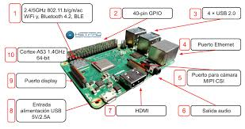
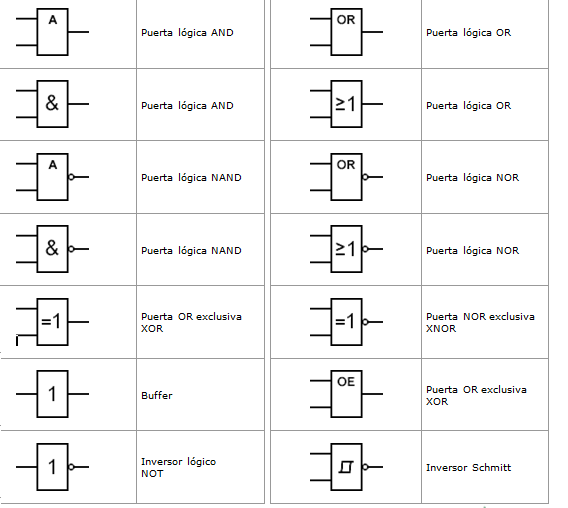
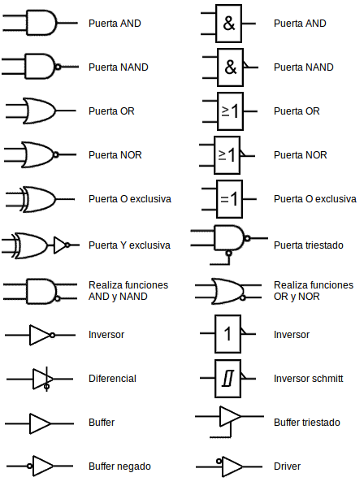

<H2>INFORME</H2>

<H3>1. PLANTEAMIENTO DEL PROBLEMA</H3>

El micro-ordenador Google Coral, entra al mercado ofreciendo ciertos atributos nuevos, los cuales potenciaran la inteligencia artificial para lo cual esta designado este dispositivo. Además, servirá no solo para la creación de nuevas cosas, también puede alimentar el cerebro de inteligencia artificial de dispositivos ya realizados. Coral no solo tiene capacidad para ejecutar redes neuronales en el propio RPI (Raspberry PI) tal cual le permitirá incorporar de manera rápida, eficaz todo aquello sobre inteligencia artificial, evitando el peligro de hacer publico los datos, es decir dándole confidencialidad a todos los datos que lo contiene.

TPU o Unidad de Procesamiento Tensorial, viene a ser un acelerador de Inteligencia Artificial el cual fue desarrollado por Google, con objetivo en el aprendizaje automático. Además, se usó en el procesamiento de texto de Street View viniendo a proporcionar resultados de búsqueda, en conclusión, TPU viene a acelerar ciertos procesos, unificarlos, procesarlos de mejor manera, siendo uno de los circuitos integrados más importantes.

Google Colab, entra como una de las tantas herramientas que posee Google, la cual permite ejecutar y programas en Python, mediante el navegador. Es útil ya que no requiere que se configure, ofrece acceso a GPUs de manera gratuita y se puede compartir los contenidos entre cuentas GOOGLE de manera simultánea. Colab también puede ser considerado como un notebook Jupyter pero de manera gratuita, además se debe tomar en cuenta que se almacena en la nube, mediante nuestras cuentas personales y su almacenamiento disponible. También permite el uso de varias bibliotecas de aprendizaje automático.

<H3>2. OBJETIVOS</H3>
<b>Objetivos Generales</b>

-	Conocer las cualidades y funcionalidades de los puertos GPIO que se encuentran en la Raspberry Pi. 

- Conocer e implementar en nuevas plataformas virtuales ejemplos funcionales para mostrar entrada y salida de datos en la Raspberry Pi. 

<b>Objetivos Específicos</b>

- Conocer las diferentes maneras de enviar datos de entrada y salida de la Raspberry Pi

- Conocer los diferentes tipos de simuladores para ingreso y salida de datos.

- Implementar un ejemplo funcional en entrada y salida por medio de la Raspberry Pi.

- Conocer las funciones que presenta el simulador brainbox..

<H3>3. ESTADO DEL ARTE</H3>
<b>Notas sobre el uso de Google Colaboratory en la educación de Inteligencia Artificial</b> 

Un desafío en el diseño de cursos de inteligencia artificial moderna es elegir herramientas y marcos apropiados para ejemplos en clase y tareas. No sólo es importante que las herramientas sean capaces de cubrir la profundidad del material presentado en el curso, sino lo suficientemente simple como para que los instructores lo implementen en el aula y que los estudiantes mantengan el enfoque en el plan de estudios.   
Los cuadernos de Jupyter es decir, documentos interactivos entrelazados con texto y código, son una herramienta cada vez más popular para que los investigadores lleven a cabo y comuniquen los resultados de la investigación, pero lo suficientemente simples como para desarrollar ejemplos en el aula y tareas.  
Sin embargo, estos portátiles todavía requieren hardware sofisticado para ejecutar muchos de los enfoques populares en la IA hoy en día. Ofrecido como un servicio gratuito de Google, Colaboratory proporciona una interfaz Jupyter Notebook con acceso al hardware de Google. Los blocs de notas se ejecutan en máquinas virtuales basadas en Linux proporcionadas y mantenidas por Google, donde el cálculo se puede realizar con unidades de procesamiento central como lo es el CPU o acelerarse a través de unidades de procesamiento gráfico especializadas como la GPU y unidades de procesamiento de tensores como la TPU.  

- Fuente: Notes on Using Google Colaboratory in AI Education | Proceedings of the 2020 ACM Conference on Innovation and Technology in Computer Science Education. (n.d.). Recuperado en Julio 23, 2020, de https://dl.acm.org/doi/abs/10.1145/3341525.3393997

<b>Consultas relacionales con una unidad de procesamiento de tensor</b>

Los procesadores de uso general han alcanzado una meta con respecto a la densidad de integración y las velocidades de reloj. Al mismo tiempo, las innovaciones en los sistemas han eliminado las ineficiencias en gran medida.  
Un enfoque común es el reusar el hardware que está disponible en grandes cantidades a bajo costo, más prominentemente las Unidades de Procesamiento de Gráficos en este caso la GPU. La desventaja aquí es que el diseño de esos dispositivos fue desarrollado para un caso de uso muy diferente, juegos de ordenador 3D, y sólo benefician en parte el caso de uso de procesamiento de datos.  
La eficiencia en esas tareas se logra con memoria de gran ancho de banda y paralelismo masivo de computación.  

- Fuente: Relational Queries with a Tensor Processing Unit | Proceedings of the 15th International Workshop on Data Management on New Hardware. (n.d.). Recuperado en Julio 23, 2020, de https://dl.acm.org/doi/abs/10.1145/3329785.3329932

<b>Mejorar la eficiencia energética y la resiliencia de errores de una unidad de procesamiento de tensor de umbral cercano</b>

Los avances en inteligencia artificial han entrado en un nuevo reino debido al desarrollo de arquitecturas específicas de dominio dedicadas al procesamiento de redes neuronales.   
Tensor Processing Unit (TPU), un circuito integrado específico de aplicaciones personalizadas creado por Google, es uno de estos aceleradores.  
El rápido aumento de las cargas de trabajo exige un aumento de la velocidad de procesamiento y el volumen de implementación. Sin embargo, tiene un costo de un uso intensivo de energía, afectando así la eficiencia energética del sistema.   
Los aceleradores como las TPU están diseñados para ofrecer un rendimiento muy alto para cargas de trabajo de inferencia de DNN. Aunque las condiciones de funcionamiento de NTC pueden garantizar un bajo consumo de energía, el rendimiento se reduce en gran medida debido a los transistores más lentos y los retrasos computacionales más largos.  

- Fuente: Enhancing Energy Efficiency and Error Resilience of a Near-Threshold Tensor Processing Unit - IEEE Conference Publication. (n.d.). Recuperado en Julio 28, 2020, de https://ieeexplore.ieee.org/abstract/document/9045479

<H3>4. MARCO TEORICO</H3>

Google Coral, se desarrolló únicamente con el objetivo de realizar tareas de machine learning las cuales se integran en tareas de producción de manera eficaz y rápida. Hace uso de la red neuronal TensorFlow Lite y del modulo Edge TPU. Que es de tipo SOM (System on Module) donde van a estar ensamblados el procesador, la GPU, la RAM, el chip del WiFi y la Flash.

Coral trabaja para satisfacer las necesidades del cliente, por lo cual idearon dos productos a la venta los cuales son aceleradores y plazas de desarrollo para la creación de prototipos de nuevas ideas, y módulos para alimentar el cerebro de inteligencia artificial de los dispositivos de producción, tales como cámaras inteligentes y sensores.

Coral es capaz de ejecutar redes neurales en el propio RPI, de forma que “le es posible incorporar de manera rápida y eficaz, sin que sus proyectos representen un peligro para la confidencialidad de datos”.

Dentro de las especificaciones técnicas, son:

- CPU: NXP i.MXM 8M SOC (Cortex-A53 quad core)

- GPU: integrada, GC7000 Lite Graphics

- Coprocesador: Google Edge TPU

- RAM: 1 GB LPDDR4

- Almacenamiento: Flash eMMC de 8 GB

- Conectividad: WiFi 2×2 MIMO de doble banda y Bluetooth 4.1

- Dimensiones: 48 x 40 x 5 mm

Las especificaciones de la placa base son:

- Almacenamiento: microSD

- USB: Un USB C para funcionalidad OTG, un USB C para la alimentación, un USB de tip0o micro USB para consola y un puerto USB A

- LAN: puerto Gigabit Ethernet

- Audio: un conector mini jack de 3,5 mm y un terminal de 4 pines para altavoces estéreo

- Vídeo: Un conector HDMI 2.0a de tamaño completo y un conector de 24 pines para una cámara MIPI-CSI2

- GPIO: un conector de 40 pines

- Alimentación: 5 V Corriente continua

- Dimensiones: 88 x 60 x 24 mm

El módulo Edge TPU se ha diseñado para proporcionar un gran rendimiento en aplicaciones destinadas al aprendizaje automático, su tamaño compacto y reducido consumo de potencia lo hacen perfecto para ser integrado en sistemas dedicados al IoT, que realizan funciones de reconocimiento de imagen y de texto.

La incorporación de este chip a la Google Coral hace que se reduzca de manera exponencial el tiempo que requiere la red neuronal para procesar los datos que le son suministrados.

TensorFlow, se trata de una librería realizada en código abierto, la cual se ha desarrollado con un ecosistema de herramientas y una comunidad detrás de ella, cuyo único objetivo es potenciar el desarrollo de aplicaciones de Inteligencia Artificial y aprendizaje automático. Pero la novedad que presenta Google Coral, es que este pequeño micro PC es capaz de utilizarlo en tiempo real.

Google Colab, es una herramienta de Google, la cual trata de ser un entorno de maquinas virtuales basado en Jupyter Notebooks. Se pueden ejecutar en la nube, donde podremos escoger si correr en una CPU, GPU o en una TPU, todo esto de manera gratuita. No obstante, hay ciertas restricciones, como por ejemplo que una sesión dura 12 horas, pasado el tiempo se realiza una limpieza y se perderán ciertas variables, archivos que se deberán tener allí.

Sirve como medio para simular o experimentar con machine learning y Deep learning, pero sin tener que ir por costos de procesamiento de la nube, además el ambiente de trabajo ya tiene librerías instaladas las cuales están listas para utilizar, una de ellas antes mencionada es TensorFlow.

<H3>5. DIAGRAMAS</H3>

Estructura basica de los puertos GPIO.</b>

Entrada digital de datos.</b>

Salida digital de datos.</b>

Funciones alternativas de los puertos GPIO.</b>

Configuracion analogica de los puertos GPIO.</b>

<H3>6. LISTA DE COMPONENTES</H3>

<b>Raspberry Pi</b>

•	CPU + GPU: Broadcom BCM2837B0, Cortex-A53 (ARMv8) 64-bit SoC @ 1.4GHz

•	RAM: 1GB LPDDR2 SDRAM

•	Wi-Fi + Bluetooth: 2.4GHz y 5GHz IEEE 802.11.b/g/n/ac, Bluetooth 4.2, BLE

•	Ethernet: Gigabit Ethernet sobre USB 2.0 (300 Mbps)

•	GPIO de 40 pines

•	HDMI

•	4 puertos USB 2.0

•	Puerto CSI para conectar una cámara.

•	Puerto DSI para conectar una pantalla táctil

•	Salida de audio estéreo y vídeo compuesto

•	Micro-SD

•	Power-over-Ethernet (PoE)

<b>Brainbox Simulator</b>

<H3>7. MAPA DE VARIABLES</H3>

<H3>8. EXPLICACION DEL CODIGO FUENTE</H3>

<H3>9. DESCRIPCION DE PRERREQUISITOS Y CONFIGURACION</H3>

Para poder utilizar al 100% esta paltaforma de simulacion es necesiro creare un acuenta en la cual se guardara todos nuestros proyectos y cambios que vayamos realizando , y tambien es necesario tener un conocimiento claro acerca de las compuertas y señales logicas ya que en esta plataforma se utilizan estas mismas para poder mandar un a señal a la raspberry pi

<H3>10. APORTACIONES</H3>
<b>Compuertas Lógicas</b>

son circuitos electrónicos conformados internamente por transistores que se encuentran con arreglos especiales con los que otorgan señales de voltaje como resultado o una salida de forma booleana, están obtenidos por operaciones lógicas binarias (suma, multiplicación). También niegan, afirman, incluyen o excluyen según sus propiedades lógicas. Estas compuertas se pueden aplicar en otras áreas de la ciencia como mecánica, hidráulica o neumática.

Existen diferentes tipos de compuertas y algunas de estas son más complejas, con la posibilidad de ser simuladas por compuertas más sencillas. Todas estas tienen tablas de verdad que explican los comportamientos en los resultados que otorga, dependiendo del valor booleano que tenga en cada una de sus entradas.

Trabajan en dos estado, "1" o "0", los cuales pueden asignarse a la lógica positiva o lógica negativa. El estado 1 tiene un valor de 5v como máximo y el estado 0 tiene un valor de 0v como mínimo y existiendo un umbral entre estos dos estados donde el resultado puede variar sin saber con exactitud la salida que nos entregara. Las lógicas se explican a continuación:

La lógica positiva es aquella que con una señal en alto se acciona, representando un 1 binario y con una señal en bajo se desactiva. representado un 0 binario.

La lógica negativa proporciona los resultados inversamente, una señal en alto se representa con un 0 binario y una señal en bajo se representa con un 1 binario.(velasco, 2018)

<b>Señales analogicas</b>

Entendemos como señal analógica un tipo de señal formada por una función matemática continua en la cual hay que tener en cuenta que la variable se encuentra representada por el periodo y la amplitud teniendo como base el tiempo. Se genera con un fenómeno de tipo electromagnético. Hay distintas magnitudes físicas e hidráulicas que pueden encajar como medio para transmitir la señal Algunas de las más comunes son la temperatura térmica o la tensión eléctrica, entre otras. Pero también es importante saber que hay muchas señales analógicas a nuestro alrededor. El mundo nos rodea con señales de este tipo en las que la variación siempre coincide en un aspecto: es continua. Ocurre con la energía o con la luz, por mencionar solo algunos de los ejemplos que se pueden encontrar dentro de la naturaleza. Pero también hay otros tipos de señales analógicas, como las que están vinculadas a la voz y el sonido.(Universidad Internacional de Valencia, 2018)

<b>Transistor</b>

El transistor es un componente electrónico constituido por materiales semiconductores que prácticamente revolucionó todos los aparatos electrónicos sin excepción alguna, ya que gracias a sus pequeñas dimensiones y sus múltiples funcionalidades logró disminuir los tamaños de todo aparato considerablemente. Gracias a los transistores también se logró la construcción de circuitos integrados, es decir “Chips con infinidad de transistores capaces de tener diversos circuitos eléctricos y electrónicos en encapsulados plásticos de tan solo unos pocos centímetros”.(Mecafenix, 2019)

<H3>11. CONCLUSIONES</H3>

Realizada la investigación sobre los puertos de entrada y salida en la Raspberry Pi  y además la simulación en brainbox, se llegó a las siguientes conclusiones:: 
-	Mediante la investigación y la implementación del ejemplo funcional en la plataforma de barín box se logró determinar varios de las herramientas que la plataforma presenta para la simulación de circuito y otros temas. 
-	Los simuladores de entrada y salida de datos para la  Raspberry Pi tienen con base el uso de los puertos GPIO mediante los cuales pueden mandar y recibir impulsos eléctricos los cuales nos ayudan a generar  programas de manera funcional. 
-	Se implementó de manera exitosa un  ejemplo funcional sobre la entrada y salida de datos en los puertos GPIO además de conocer de manera más formal el simulador brainbox. 
-	Durante el desarrollo de la implementación del ejemplo en brainbox se nos mostró varias de las herramientas presentadas mediante las cuales la plataforma nos permite realizar varias funciones como las simulación de circuitos integrados y otras como la simulación de elementos más avanzados como la webcam entre otros. 
Después de haber logrado los objetivos específicos se llegó a la conclusión que gracias a estos objetivos específicos se lograra llegar a la implementación y la realización de los objetivos generales: 
- Los puertos GPIO presentes en la Raspberry Pi tienen diferentes características entre las cueles encontramos el no tener protección a las cargas eléctricas recibidas además de estar enumerados por su posición físicas o también pueden estar enumerados por la posicion de un chip..

- Se logró manejar de manera satisfactoria el uso de nuevas plataformas de simulación en este caso en específico la plataforma virtual Brainbox.

<H3>12. RECOMENDACIONES</H3>

-	Durante esta situación de cuarentena y para evitar el consumo innecesario de dinero es considerado de buena manera el uso de simuladores de circuitos además de permitir la corrección de errores los cuales de manera física se tendrían problemas para ubicarlos.  
-	Conocer las diferentes formas en las cuales se puede hacer el ingreso y la salida de datos atreves de los puertos GPIO y mostrar la salida de la información mediante controladores o diferentes tipos de hardware adicional.  

<H3>13. CRONOGRAMA</H3>

<H3>14. BIBLIOGRAFIA</H3>
Mecafenix, I. (8 de Agosto de 2019). Ingeniería Mecafenix. Obtenido de Transistor: https://www.ingmecafenix.com/electronica/el-transistor/
Universidad Internacional de Valencia. (21 de marzo de 2018). Ciencia y tecnologia. Obtenido de Todo lo que debes saber sobre la señal analógica: https://www.universidadviu.com/lo-debes-saber-la-senal-analogica/
velasco, R. (2 de Julio de 2018). Hardzone. Obtenido de Analisis raspberry pi 3 : https://hardzone.es/reviews/perifericos/analisis-raspberry-pi-3-modelo-b/

- JORGE CACHO HERNÁNDEZ, «Raspberry Pi: tutoriales Servidor web, ownCloud y XBMC.,» 27 Enero 2008. [En línea]. Available: file:///C:/Users/home/Downloads/102190284-Raspberry-Pi-tutoriales-servidor-web-ownCloud-y-XBMC.pdf  
- C. Muñoz, «Historia de la informatica “Raspberry Pi,» Blog sobre Historia de la Informática, 18 Diciembre 2013. [En línea]. Available: https://histinf.blogs.upv.es/2013/12/18/raspberry-pi/#:~:text=Raspberry%20PI%20es%20una%20placa,de%20la%20inform%C3%A1tica%20en%20las  
 - C. Muñoz, «Historia de la informatica “Raspberry Pi,» Blog sobre Historia de la Informática, 18 Diciembre 2013. [En línea]. Available: https://histinf.blogs.upv.es/2013/12/18/raspberry-pi/#:~:text=Raspberry%20PI%20es%20una%20placa,de%20la%20inform%C3%A1tica%20en%20las  
- Maria Sol Vicet Illas, «Historia y defincion de software libre en el mundo e lainformatica inicial,» Ecured.cu, Ecuador, 2017 Available: https://www.ecured.cu/Software_libre#:~:text=Seg%C3% BAn%20la%20Free%20Software%20Foundation,programa%2C%20con%20cualquier%20prop%C3%B3sito%3B%20de  
- Moya, F., 2020. Entradas Y Salidas Digitales · Taller De Raspberry Pi. [online] Franciscomoya.gitbooks.io. Available at: <https://franciscomoya.gitbooks.io/taller-de-raspberry-pi/content/es/elems/gpio.html> [Accessed 22 August 2020].  
- Diec.unizar.es. 2020. [online] Available at: <http://diec.unizar.es/~tpollan/libro/Apuntes/digap8.pdf> [Accessed 22 August 2020].  

<H3>15. ANEXOS</H3>
<H3>15.1 MANUAL DE USUARIO</H3>

Adjunto en la carpeta Manual de Usuario.

<H3>15.2 HOJAS TECNICAS</H3>

Adjunto en la carpeta Hojas Técnicas.

