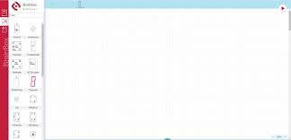
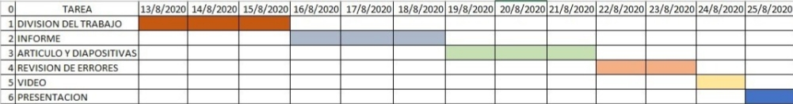

<H2>INFORME</H2>

<H3>1. PLANTEAMIENTO DEL PROBLEMA</H3>

Raspberry Pi, es un ordenador de tamaño de tarjeta de crédito que se conecta a su televisor y un teclado también es considerado como una placa que soporta varios componentes necesarios en un ordenador común, es de tamaño compacto el cual puede ser utilizado para muchas de las actividades que realiza su PC.

Sabemos que es un ordenador muy funcional y debido a su tamaño puede funcionar para muchos otros propósitos, pero se debe tener en cuenta, que el usuario debe tener algunas ideas sobre programación o de computación, para poder hacerla arrancar y configurar, entre otras más operaciones. 

Además, no en todos los países está disponible la adquisición de manera fácil de estos mini ordenadores, por lo cual se necesita muchas veces manejar esto mediante simuladores, donde existen varios de ellos, los cuales cumplen con la mayoría de sus características y otros no, en este caso se usará BrainBox Simulator el cual está cumpliendo con las expectativas.

<H3>2. OBJETIVOS</H3>
<b>Objetivos Generales</b>

-	Conocer las cualidades y funcionalidades de los puertos GPIO que se encuentran en la Raspberry Pi. 

- Conocer e implementar en nuevas plataformas virtuales ejemplos funcionales para mostrar entrada y salida de datos en la Raspberry Pi. 

<b>Objetivos Específicos</b>

- Conocer las diferentes maneras de enviar datos de entrada y salida de la Raspberry Pi

- Conocer los diferentes tipos de simuladores para ingreso y salida de datos.

- Implementar un ejemplo funcional en entrada y salida por medio de la Raspberry Pi.

- Conocer las funciones que presenta el simulador brainbox..

<H3>3. ESTADO DEL ARTE</H3>
<b>Incorporación de una Raspberry Pi en un curso inicial de sistemas de información informática</b> 

La Raspberry Pi es una pequeña computadora útil para enseñar a los estudiantes conocimientos básicos de computación. Este artículo analiza la integración de Raspberry Pi en un curso introductorio de sistemas de información. Anteriormente, el curso inicial en la Facultad de Ingeniería y Ciencias de la Información era un curso de aplicaciones generales no centrado en ciencias de la computación o ingeniería. Se desarrolló un nuevo curso integrando la frambuesa pi con laboratorios prácticos para mejorar la participación de los estudiantes. El curso inicial debe ser emocionante y motivador para los estudiantes. Mediante la creación de un nuevo curso con laboratorios interesantes que integran la Raspberry Pi, se lograrán tasas de pase más altas y la satisfacción de los estudiantes.   

- Fuente: Incorporación de una Raspberry Pi en un curso inicial de sistemas de información informática - IEEE Conference Publication. (n.d.). Recuperado en Agosto 24, 2020, de https://ieeexplore.ieee.org/document/8190737

<b>Educación de alta calidad y bajo costo con la Raspberry Pi</b>

La familia Raspberry Pi Single Board Computer (SBC) ha ganado popularidad en diversas áreas, mientras que la educación sigue siendo el motor fundamental detrás del diseño. La Fundación Raspberry Pi proporciona kits de bajo costo, específicamente para la educación, en conjunto con Google. Estos kits y modificaciones para obtener resultados educativos óptimos, y una experiencia enriquecida se discutirá en este artículo. El tutorial constará de ejemplos de proyectos y ejemplos de código que se pueden adaptar rápidamente para varias situaciones de aprendizaje. Se proporcionará una lista de hardware, rellenada y optimizada para un aprendizaje rentable y eficaz. La familia Raspberry Pi y la familia Arduino también se pueden utilizar para la educación, como suplentes, o en combinación con la Raspberry Pi Zero y las diferencias serán resaltadas y discutidas. Numerosos recursos web en constante evolución, así como implementaciones de hardware con varias composiciones están disponibles, y el método de adaptarlos a entornos educativos se discutirá brevemente.  

- Fuente: Educación de alta calidad y bajo costo con Raspberry Pi - IEEE Conference Publication. (n.d.). Recuperado en Agosto 24, 2020, de https://ieeexplore.ieee.org/document/8239274

<b>Remote control de aparatos a base de Raspberry pi</b>

Este artículo describe con respecto al dispositivo de los aparatos domésticos depende de la aplicación humanoide compatible con Raspberry pi. En la etapa inicial se ha recordado la automatización del hogar asociada a una aplicación, además se ha desarrollado dentro de la etapa que se centra en el método humanoide. Los dispositivos móviles son unidades gloriosas en la prestación de un programa en un enfoque extremadamente domótico. Y estará listo para comunicarse con una red domótica a través de Internet, para soportar instantáneamente con los dispositivos dentro de la red, ya que estos dispositivos en toda probabilidad ponen en impacto protocolos de bajo consumo de energía casi como ZigBee, Wi-Fi, etc. Durante este artículo sobre electrodomésticos dominantes, a través del mismo humanoide utilizando Wi-Fi como protocolo de comunicación, Raspberry pi como sistema de servidor. El programa ha creado para el mismo humanoide que permita al usuario mantenerse conectado con la Raspberry pi. Sin duda para ser interconectado con una tarjeta que controla la instrumentación de la casa. El comprador se comunica con la tarjeta correspondiente.   

- Fuente: Control remoto de aparatos basados en Raspberry pi - IEEE Conference Publication. (n.d.). Recuperado en Agosto 24, 2020, de https://ieeexplore.ieee.org/document/7802863

<H3>4. MARCO TEORICO</H3>
<H3>4.1 Raspberry Pi</H3>

La creación de la Raspberry Pi se realizó en el año 2006 como una idea, pero no fue lanzado al mercado hasta febrero del 2012. Ha sido desarrollado por un grupo de profesionales y estudiantes, de la Universidad de Cambridge y su misión fue fomentar la enseñanza de las ciencias de la computación los niños. De hecho, en enero del 2013, Google donó más de 15.000 Raspberry Pi para colegios en Reino Unido.

Cuenta con varios elementos que son muy importantes, uno de ellos es Scratch, el lenguaje de programación sumamente amigable, ideal para las personas que se inician en la programación. Cabe mencionar que con scratch puedes controlar motores, luces, cámaras, sensores táctiles y más, todo a través del GPIO.

Otro lenguaje de programación que se usa es Python, el lenguaje de programación número uno para desarrollar con tu Raspberry Pi, con el podrás desarrollar potentes programas que te permitirán tomar datos del exterior o trabajar a través de actuadores por el puerto GPIO, manipular datos, recibir información desde el puerto serial con un Arduino

Existen dos versiones de Python en Raspbian, Python 2 y 3. La versión numero 2 termino su desarrollo en 2010, pero mantiene su soporte a manera de legado, para aquellas aplicaciones que ya fueron desarrolladas bajo esta versión, por ende, se recomienda utilizar Python 3, el cual es la versión que se encuentra actualmente en desarrollo.

-Imagen de la Raspberry Pi Física Fuente: https://upload.wikimedia.org/wikipedia/commons/f/f1/Raspberry_Pi_4_Model_B

<H3>4.2 Hardware</H3>

-Versiones de la Raspberry Pi y sus características. Fuente: https://es.wikipedia.org/wiki/Raspberry_Pi

<H3>4.3 Scratch</H3>

Es un lenguaje de programación visual desarrollado por el Grupo Lifelong Kindergarten del MIT Media Lab. Su principal característica consiste en que permite el desarrollo de habilidades mentales mediante el aprendizaje de la programación sin tener conocimientos profundos sobre el código. 

Sus características ligadas al fácil entendimiento del pensamiento computacional han hecho que sea muy difundido en la educación de niños, adolescentes y adultos.

-Interfaz Scratch 3.0 Fuente: https://upload.wikimedia.org/wikipedia/commons/thumb/e/e3/Scratch_3.0_GUI.png/245px-Scratch_3.0_GUI.png

<H3>4.4 Python</H3>

Es un lenguaje de programación interpretado cuya función es obtener legibilidad de su código. Se trata de un lenguaje de programación multiparadigma, ya que soporta orientación a objetos, programación imperativa y, en menor medida, programación funcional. Es un lenguaje interpretado, dinámico y multiplataforma.

Es administrado por la Python Software Foundation. Posee una licencia de código abierto, denominada Python Software Foundation License.

-Python Logo Fuente: https://blog.interdominios.com/wp-content/2008/python-lenguaje-de-programacion-1280x720.jpg

<H3>5. DIAGRAMAS</H3>

Estructura basica de los puertos GPIO.</b>

Entrada digital de datos.</b>

Salida digital de datos.</b>

Funciones alternativas de los puertos GPIO.</b>

Configuracion analogica de los puertos GPIO.</b>

<H3>6. LISTA DE COMPONENTES</H3>

<b>Raspberry Pi</b>

•	CPU + GPU: Broadcom BCM2837B0, Cortex-A53 (ARMv8) 64-bit SoC @ 1.4GHz

•	RAM: 1GB LPDDR2 SDRAM

•	Wi-Fi + Bluetooth: 2.4GHz y 5GHz IEEE 802.11.b/g/n/ac, Bluetooth 4.2, BLE

•	Ethernet: Gigabit Ethernet sobre USB 2.0 (300 Mbps)

•	GPIO de 40 pines

•	HDMI

•	4 puertos USB 2.0

•	Puerto CSI para conectar una cámara.

•	Puerto DSI para conectar una pantalla táctil

•	Salida de audio estéreo y vídeo compuesto

•	Micro-SD

•	Power-over-Ethernet (PoE)

<b>Brainbox Simulator</b>

<H3>7. MAPA DE VARIABLES</H3>

<H3>8. EXPLICACION DEL CODIGO FUENTE</H3>

<H3>9. DESCRIPCION DE PRERREQUISITOS Y CONFIGURACION</H3>

Para poder utilizar al 100% esta paltaforma de simulacion es necesiro creare un acuenta en la cual se guardara todos nuestros proyectos y cambios que vayamos realizando , y tambien es necesario tener un conocimiento claro acerca de las compuertas y señales logicas ya que en esta plataforma se utilizan estas mismas para poder mandar un a señal a la raspberry pi

<H3>10. APORTACIONES</H3>
<b>Compuertas Lógicas</b>

son circuitos electrónicos conformados internamente por transistores que se encuentran con arreglos especiales con los que otorgan señales de voltaje como resultado o una salida de forma booleana, están obtenidos por operaciones lógicas binarias (suma, multiplicación). También niegan, afirman, incluyen o excluyen según sus propiedades lógicas. Estas compuertas se pueden aplicar en otras áreas de la ciencia como mecánica, hidráulica o neumática.

Existen diferentes tipos de compuertas y algunas de estas son más complejas, con la posibilidad de ser simuladas por compuertas más sencillas. Todas estas tienen tablas de verdad que explican los comportamientos en los resultados que otorga, dependiendo del valor booleano que tenga en cada una de sus entradas.

Trabajan en dos estado, "1" o "0", los cuales pueden asignarse a la lógica positiva o lógica negativa. El estado 1 tiene un valor de 5v como máximo y el estado 0 tiene un valor de 0v como mínimo y existiendo un umbral entre estos dos estados donde el resultado puede variar sin saber con exactitud la salida que nos entregara. Las lógicas se explican a continuación:

La lógica positiva es aquella que con una señal en alto se acciona, representando un 1 binario y con una señal en bajo se desactiva. representado un 0 binario.

La lógica negativa proporciona los resultados inversamente, una señal en alto se representa con un 0 binario y una señal en bajo se representa con un 1 binario.(velasco, 2018)

<b>Señales analogicas</b>

Entendemos como señal analógica un tipo de señal formada por una función matemática continua en la cual hay que tener en cuenta que la variable se encuentra representada por el periodo y la amplitud teniendo como base el tiempo. Se genera con un fenómeno de tipo electromagnético. Hay distintas magnitudes físicas e hidráulicas que pueden encajar como medio para transmitir la señal Algunas de las más comunes son la temperatura térmica o la tensión eléctrica, entre otras. Pero también es importante saber que hay muchas señales analógicas a nuestro alrededor. El mundo nos rodea con señales de este tipo en las que la variación siempre coincide en un aspecto: es continua. Ocurre con la energía o con la luz, por mencionar solo algunos de los ejemplos que se pueden encontrar dentro de la naturaleza. Pero también hay otros tipos de señales analógicas, como las que están vinculadas a la voz y el sonido.(Universidad Internacional de Valencia, 2018)

<b>Transistor</b>

El transistor es un componente electrónico constituido por materiales semiconductores que prácticamente revolucionó todos los aparatos electrónicos sin excepción alguna, ya que gracias a sus pequeñas dimensiones y sus múltiples funcionalidades logró disminuir los tamaños de todo aparato considerablemente. Gracias a los transistores también se logró la construcción de circuitos integrados, es decir “Chips con infinidad de transistores capaces de tener diversos circuitos eléctricos y electrónicos en encapsulados plásticos de tan solo unos pocos centímetros”.(Mecafenix, 2019)

<H3>11. CONCLUSIONES</H3>

Realizada la investigación sobre los puertos de entrada y salida en la Raspberry Pi  y además la simulación en brainbox, se llegó a las siguientes conclusiones:: 
-	Mediante la investigación y la implementación del ejemplo funcional en la plataforma de barín box se logró determinar varios de las herramientas que la plataforma presenta para la simulación de circuito y otros temas. 
-	Los simuladores de entrada y salida de datos para la  Raspberry Pi tienen con base el uso de los puertos GPIO mediante los cuales pueden mandar y recibir impulsos eléctricos los cuales nos ayudan a generar  programas de manera funcional. 
-	Se implementó de manera exitosa un  ejemplo funcional sobre la entrada y salida de datos en los puertos GPIO además de conocer de manera más formal el simulador brainbox. 
-	Durante el desarrollo de la implementación del ejemplo en brainbox se nos mostró varias de las herramientas presentadas mediante las cuales la plataforma nos permite realizar varias funciones como las simulación de circuitos integrados y otras como la simulación de elementos más avanzados como la webcam entre otros. 
Después de haber logrado los objetivos específicos se llegó a la conclusión que gracias a estos objetivos específicos se lograra llegar a la implementación y la realización de los objetivos generales: 
- Los puertos GPIO presentes en la Raspberry Pi tienen diferentes características entre las cueles encontramos el no tener protección a las cargas eléctricas recibidas además de estar enumerados por su posición físicas o también pueden estar enumerados por la posicion de un chip..

- Se logró manejar de manera satisfactoria el uso de nuevas plataformas de simulación en este caso en específico la plataforma virtual Brainbox.

<H3>12. RECOMENDACIONES</H3>

-	Durante esta situación de cuarentena y para evitar el consumo innecesario de dinero es considerado de buena manera el uso de simuladores de circuitos además de permitir la corrección de errores los cuales de manera física se tendrían problemas para ubicarlos.  
-	Conocer las diferentes formas en las cuales se puede hacer el ingreso y la salida de datos atreves de los puertos GPIO y mostrar la salida de la información mediante controladores o diferentes tipos de hardware adicional.  

<H3>13. CRONOGRAMA</H3>

<H3>14. BIBLIOGRAFIA</H3>
Mecafenix, I. (8 de Agosto de 2019). Ingeniería Mecafenix. Obtenido de Transistor: https://www.ingmecafenix.com/electronica/el-transistor/
Universidad Internacional de Valencia. (21 de marzo de 2018). Ciencia y tecnologia. Obtenido de Todo lo que debes saber sobre la señal analógica: https://www.universidadviu.com/lo-debes-saber-la-senal-analogica/
velasco, R. (2 de Julio de 2018). Hardzone. Obtenido de Analisis raspberry pi 3 : https://hardzone.es/reviews/perifericos/analisis-raspberry-pi-3-modelo-b/

- JORGE CACHO HERNÁNDEZ, «Raspberry Pi: tutoriales Servidor web, ownCloud y XBMC.,» 27 Enero 2008. [En línea]. Available: file:///C:/Users/home/Downloads/102190284-Raspberry-Pi-tutoriales-servidor-web-ownCloud-y-XBMC.pdf  
- C. Muñoz, «Historia de la informatica “Raspberry Pi,» Blog sobre Historia de la Informática, 18 Diciembre 2013. [En línea]. Available: https://histinf.blogs.upv.es/2013/12/18/raspberry-pi/#:~:text=Raspberry%20PI%20es%20una%20placa,de%20la%20inform%C3%A1tica%20en%20las  
 - C. Muñoz, «Historia de la informatica “Raspberry Pi,» Blog sobre Historia de la Informática, 18 Diciembre 2013. [En línea]. Available: https://histinf.blogs.upv.es/2013/12/18/raspberry-pi/#:~:text=Raspberry%20PI%20es%20una%20placa,de%20la%20inform%C3%A1tica%20en%20las  
- Maria Sol Vicet Illas, «Historia y defincion de software libre en el mundo e lainformatica inicial,» Ecured.cu, Ecuador, 2017 Available: https://www.ecured.cu/Software_libre#:~:text=Seg%C3% BAn%20la%20Free%20Software%20Foundation,programa%2C%20con%20cualquier%20prop%C3%B3sito%3B%20de  
- Moya, F., 2020. Entradas Y Salidas Digitales · Taller De Raspberry Pi. [online] Franciscomoya.gitbooks.io. Available at: <https://franciscomoya.gitbooks.io/taller-de-raspberry-pi/content/es/elems/gpio.html> [Accessed 22 August 2020].  
- Diec.unizar.es. 2020. [online] Available at: <http://diec.unizar.es/~tpollan/libro/Apuntes/digap8.pdf> [Accessed 22 August 2020].  

<H3>15. ANEXOS</H3>
<H3>15.1 MANUAL DE USUARIO</H3>

Adjunto en la carpeta Manual de Usuario.

<H3>15.2 HOJAS TECNICAS</H3>

Adjunto en la carpeta Hojas Técnicas.

